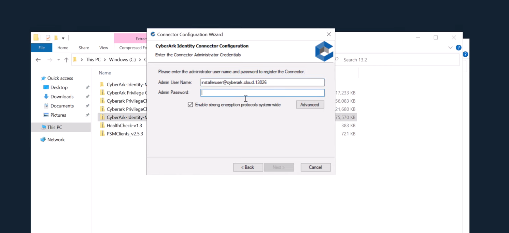
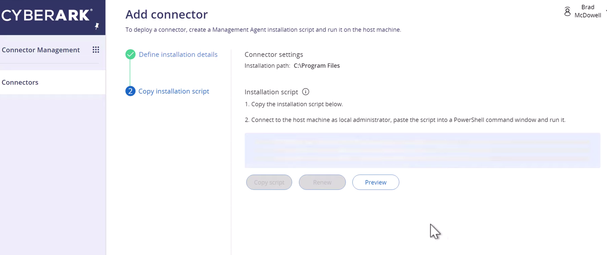

## CyberArk Identity Connector

- CyberArk Identity Connector - A software package installed on a dedicated join-domain server with Active Directory / Domain Controller
    1. Install package on host
    2. Using a installer user on CyberArk
    
    - Input to the wizard
    

Note: The installer user ensure trust between the Connector host to CyberArk Identity.

- Connector Management - In order to manage the connect (e.g. healthcheck, patch,..), each Connector host must install a package - **Management Agent**
    1. Install software package on the same host (configured as Connector)
    2. Add a connector by running a script as a Local Adminstrator:
    

    