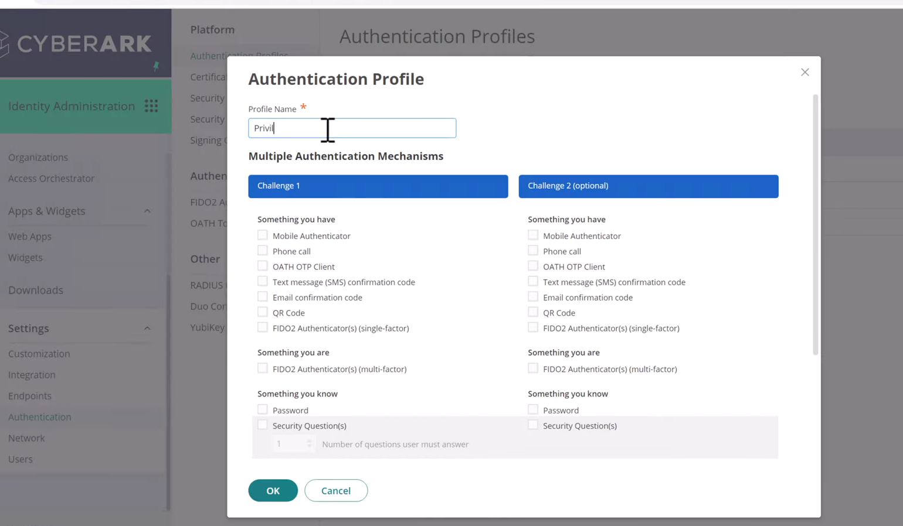
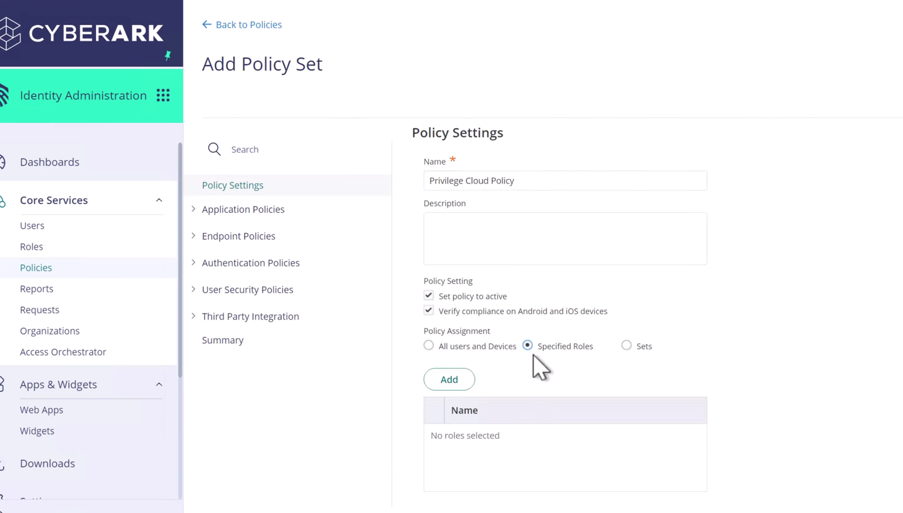
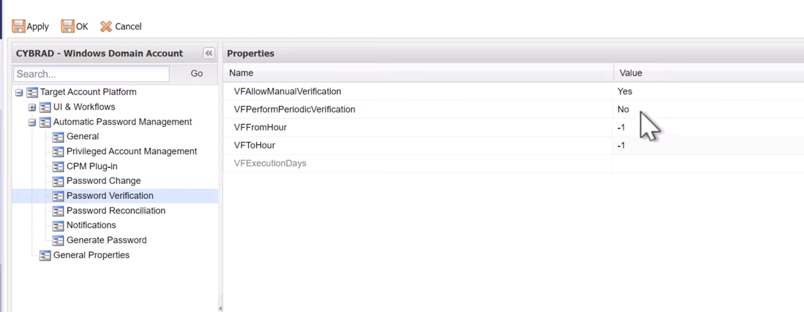

## CyberArk Components

1. CyberArk PAM - Self-Hosted

    At the minimum requirement, this includes:
    - Vault (EPV)
    - PSM server
    - CPM server
    - PVWA

2. CyberArk PAM - Privilege Cloud

    This At the minimum requirement, this includes:
    - CyberArk Privilege Cloud tenant
    - PAM Connector hosts (customer-hosted), including: Identity Connector; PSM/CPM Connector


### Identity Setup:

1. Create a `Authentication Profile`
    
    This define how to authenticate with CyberArk

    

2. Create `Role` and `Member`

    CyberArk manage users via `Role` and under each `Role`, set of `Member` can be added in    

3. Create and confgiure `Policy`
    
    This includes refering to `Authentication Profile`
    Also assign `Role` under specific `Policy`

    


### Safe and account in CyberArk

```
Member
 |
 |
 v
Safe
 └─ Account
     ├─ Address
     ├─ Username
     ├─ Password
     └─ Platform
          ├─ Password rules
          ├─ CPM logic
          ├─ PSM connection
          └─ Required properties
```
Member or End user is added to a `Safe`.

`Account` is stored in a `Safe`. Each `Account` is associated with a `Platform`.

`Platform` is a set of rules that tell CyberArk how to manage the `Account`. 



