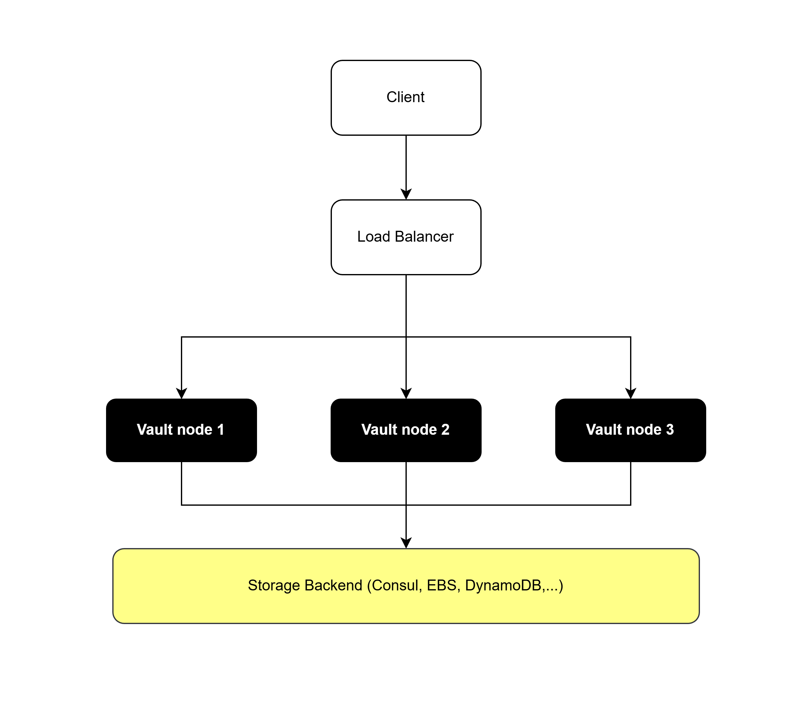
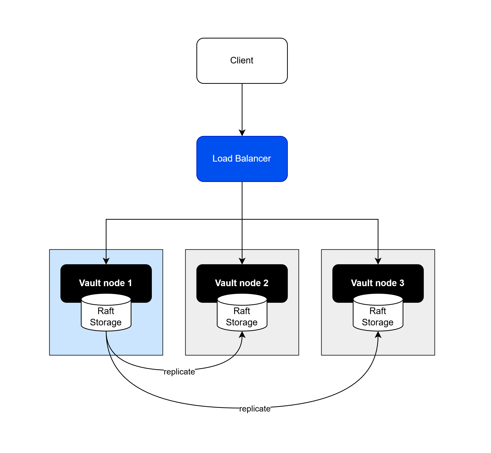
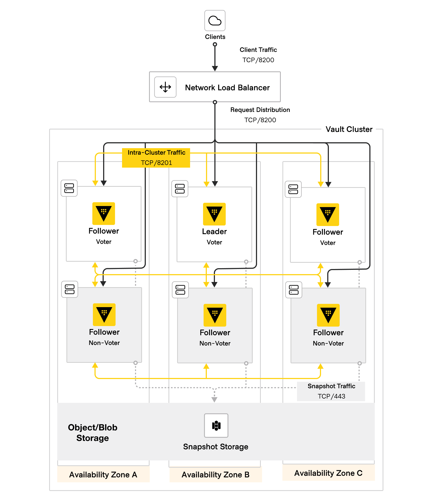
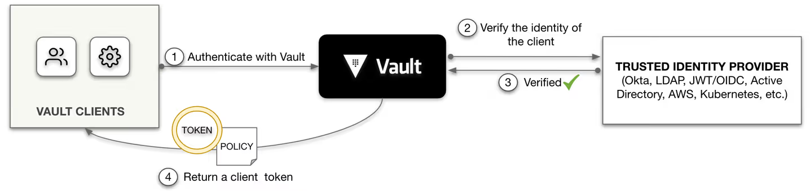

## HashiCorp architecture

Prerequisite:

- At the minimum, only need 1 host to run the Vault software

### Storage Backend

Storage Backend is a block-storage for Vault software to write encrypted data in. In the Vault context, there are expectation for:

- The storage must ensure the coordination:
    - All Vault nodes see the same state
    - Writes are serialized
- The storage must ensure failover
    - One node fails → system continues
    - Automatic leader election

There are 2 options in HashiCorp vault:

1. Using seperate product - Consul, EBS, DynamoDB,...


2. Using built-in feature within Vault binary - called as Raft (need additional configuration)


### Deploy HashiCorp Vault

For HA purpose, on Prod, a Vault cluster should be deployed as below:



Reference:
https://github.com/hashicorp/terraform-aws-vault-enterprise-hvd


### Terraform and Identity Provider

#### Terraform

Terraform can be used to configure HashiCorp vault via Terraform Vault Provider

https://registry.terraform.io/providers/hashicorp/vault/latest/docs

Basically:

Terraform file (.tf file), for example:

```
resource "vault_mount" "dev-secrets" {
  path        = "dev-secrets"
  type        = "kv"
  options     = { version = "2" }
}
```

When Terraform CLI run "terraform apply", the CLI talks to Vault Provider to mount a KV secret engine to the path "dev-secret"

### Identity Provider



https://developer.hashicorp.com/vault/tutorials/auth-methods/oidc-auth

The OIDC auth method can redirect a user's browser to a configured identity provider, complete a login, and then re-route the user back to Vault's UI with a newly-created Vault token.


### Resources Path

All resources in HashiCorp vault is defined by a path:

1. auth/ 

Define authentication methods. These are plugins that verify who you are and issue Vault tokens.

```
# Allow login via Kubernetes auth
path "auth/kubernetes/login" {
  capabilities = ["create"]
}
```


2. sys/ 

Platform admin manages mounts and policies.
```
# Manage secret engine mounts
path "sys/mounts/*" {
  capabilities = ["create", "read", "update", "delete"]
}

# Manage ACL policies
path "sys/policies/acl/*" {
  capabilities = ["create", "read", "update", "delete"]
}

# Read Vault health status
path "sys/health" {
  capabilities = ["read"]
}
```

3. secret/ 

App can read its own secrets only.

```
# Read-only access to App A secrets
path "secret/data/app-a/*" {
  capabilities = ["read"]
}

# Allow listing metadata (KV v2)
path "secret/metadata/app-a/*" {
  capabilities = ["list"]
}
```


4. identity/

Identity admin manages entities and groups.

```
# Manage entities
path "identity/entity/*" {
  capabilities = ["create", "read", "update", "delete", "list"]
}

# Manage groups
path "identity/group/*" {
  capabilities = ["create", "read", "update", "delete", "list"]
}

# Lookup identity info
path "identity/lookup/*" {
  capabilities = ["read"]
}
```

### Authentication Flow

1. Application authenticates with Vault using AppRole (Role ID + Secret ID)
  - Auth method
2. Vault returns a client token with TTL
  - Policy -> applies to a identity
3. Application uses token to access secrets
  - Secret engine
4. Token must be renewed before expiration

