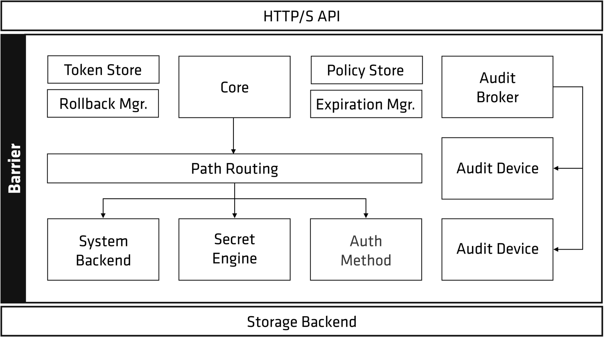

## Vault Architecture

### Overview

Vault’s encryption layer, referred to as the barrier, is responsible for encrypting and decrypting Vault data. 

Since the storage backend resides outside the barrier, it’s considered untrusted so Vault will encrypt the data before writting.

### Supporting services

Vault’s Core logs all requests and responses through the **audit broker** and forwards them to every configured audit device.

Outside of the request flow, the core performs specific background activities:

- Lease management: allowing expired client tokens or secrets to be revoked automatically with an **expiration manager**.

- Vault handles specific partial-failure cases by using write-ahead logging with a **rollback manager**.

### Sealed and Unsealed

When a Vault server is started, it begins in a **sealed** state. Before any operation can be performed on Vault, it must be **unsealed**. 

Unsealed via an Unseal key. This key will be used to decrypt the (1) root key. This (1) root key will be used to decrypt the (2) Encryption key.

The (2) Encryption key is the one that decrypt data from Storage Backend, and enters the **unsealed** state.

> Note: The default Vault configuration uses a Shamir seal; however, Vault can be auto unsealed by a trusted cloud key management system (KMS) or hardware security module (HSM) to increase security.

---

Reference:
https://developer.hashicorp.com/vault/docs/internals/architecture